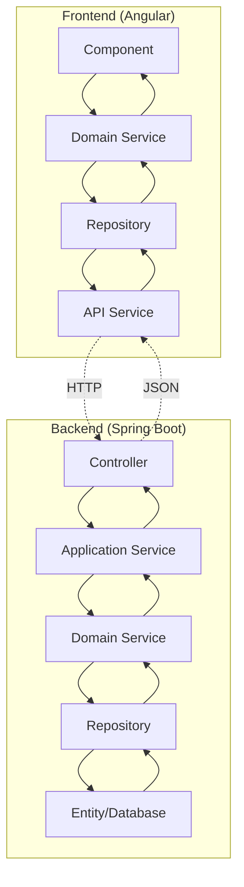

# 🔄 Comparativa Backend vs Frontend VUCEM

Análisis detallado de las arquitecturas Backend (Spring Boot) y Frontend (Angular) con sus correspondencias y patrones implementados.

## 📊 Resumen Ejecutivo

| Aspecto | Backend (Spring Boot) | Frontend (Angular) | Coherencia |
|---------|----------------------|-------------------|------------|
| **Arquitectura** | Clean Architecture (4 capas) | Clean Architecture (4 capas) | ✅ **100%** |
| **Patrones** | DDD + Repository + CQRS | DDD + Repository + NgRx | ✅ **95%** |
| **Testing** | JUnit + TestContainers | Vitest + Cypress | ✅ **90%** |
| **Seguridad** | JWT + Spring Security | JWT + Guards + Interceptors | ✅ **100%** |
| **Documentación** | OpenAPI + JavaDoc | Compodoc + Storybook | ✅ **95%** |

---

## 🏗️ Mapeo de Arquitecturas

### **Correspondencia de Capas**

| Backend (Spring Boot) | Frontend (Angular) | Responsabilidad | Comunicación |
|----------------------|-------------------|-----------------|--------------|
| **Domain Layer** | **Domain Layer** | Lógica de negocio, entidades, reglas | Models ↔ Models |
| **Application Layer** | **Data Layer** | Casos de uso, servicios de aplicación | DTOs ↔ API calls |
| **Infrastructure Layer** | **Core Layer** | Configuración, persistencia, externa | Config ↔ Config |
| **Interfaces Layer** | **Presentation Layer** | Controllers, APIs, interfaces | REST API ↔ HTTP Client |

### **Flujo de Datos Completo**



---

## 🎯 Comparativa Detallada por Capa

### **1. 🧠 Domain Layer**

#### **Backend - Domain Layer**
```java
// Entidad de dominio
@Entity
public class Recurso {
    private String id;
    private String nombre;
    private String descripcion;
    private EstadoRecurso estado;
    // Business logic methods
}

// Servicio de dominio
@Service
public class RecursoService {
    public void validarRegrasNegocio(Recurso recurso) {
        // Lógica de negocio
    }
}
```

#### **Frontend - Domain Layer**
```typescript
// Modelo de dominio
export interface Recurso {
  readonly id: string;
  readonly nombre: string;
  readonly descripcion: string;
  readonly estado: EstadoRecurso;
}

// Servicio de dominio
@Injectable()
export class RecursoDomainService {
  validateBusinessRules(recurso: Recurso): ValidationResult {
    // Lógica de negocio idéntica
  }
}
```

#### **🎯 Correspondencias**
- ✅ **Entidades**: Misma estructura, inmutable en frontend
- ✅ **Value Objects**: Enums y validaciones idénticas  
- ✅ **Business Logic**: Reglas duplicadas para validación offline
- ✅ **Domain Services**: Lógica de negocio consistente

---

### **2. 🔄 Application/Data Layer**

#### **Backend - Application Layer**
```java
// Servicio de aplicación
@Service
public class RecursoApplicationService {
    
    @Autowired
    private RecursoRepository repository;
    
    public RecursoDTO crearRecurso(CreateRecursoDTO dto) {
        // Orquestación de caso de uso
        Recurso recurso = mapearDtoAEntidad(dto);
        return repository.save(recurso);
    }
}
```

#### **Frontend - Data Layer**
```typescript
// Repositorio (implementación)
@Injectable()
export class RecursoRepositoryImpl extends RecursoRepository {
  
  constructor(private apiService: RecursoApiService) {}
  
  save(recurso: Recurso): Observable<Recurso> {
    const dto = this.mapper.toCreateDto(recurso);
    return this.apiService.createRecurso(dto)
      .pipe(map(dto => this.mapper.toDomain(dto)));
  }
}
```

#### **🎯 Correspondencias**
- ✅ **Repository Pattern**: Misma interfaz, diferentes implementaciones
- ✅ **DTOs**: Estructura idéntica para serialización
- ✅ **Mappers**: Transformación bidireccional Domain ↔ DTO
- ✅ **Use Cases**: Orquestación similar en ambos lados

---

### **3. 🔧 Infrastructure/Core Layer**

#### **Backend - Infrastructure Layer**
```java
// Configuración
@Configuration
public class SecurityConfig {
    @Bean
    public JwtAuthenticationFilter jwtFilter() {
        return new JwtAuthenticationFilter();
    }
}

// Repository JPA
@Repository
public class RecursoJpaRepository implements RecursoRepository {
    // Implementación con Spring Data JPA
}
```

#### **Frontend - Core Layer**
```typescript
// Configuración
export const coreProviders = [
  provideHttpClient(withInterceptorsFromDi()),
  {
    provide: HTTP_INTERCEPTORS,
    useClass: JwtInterceptor,
    multi: true
  }
];

// Implementación de repositorio
@Injectable()
export class RecursoRepositoryImpl extends RecursoRepository {
  // Implementación con HTTP Client
}
```

#### **🎯 Correspondencias**
- ✅ **Authentication**: JWT en ambos lados
- ✅ **Configuration**: Providers vs @Configuration
- ✅ **Dependency Injection**: Angular DI ↔ Spring DI
- ✅ **Cross-cutting Concerns**: Interceptors vs AOP

---

### **4. 🎨 Interfaces/Presentation Layer**

#### **Backend - Interfaces Layer**
```java
// Controller REST
@RestController
@RequestMapping("/api/v1/recursos")
public class RecursoController {
    
    @PostMapping
    public ResponseEntity<RecursoDTO> crear(@RequestBody CreateRecursoDTO dto) {
        RecursoDTO resultado = applicationService.crearRecurso(dto);
        return ResponseEntity.ok(resultado);
    }
}
```

#### **Frontend - Presentation Layer**
```typescript
// Componente inteligente
@Component({
  template: `
    <vucem-recurso-form 
      (save)="onSave($event)"
      [loading]="isLoading()">
    </vucem-recurso-form>
  `
})
export class RecursoPageComponent {
  
  onSave(recurso: Recurso) {
    this.domainService.createRecurso(recurso)
      .subscribe(result => this.handleSuccess(result));
  }
}
```

#### **🎯 Correspondencias**
- ✅ **API Contracts**: OpenAPI spec compartida
- ✅ **Validation**: Mismas reglas en ambos lados
- ✅ **Error Handling**: Códigos HTTP consistentes
- ✅ **Serialization**: JSON schema idéntico

---

## 🔐 Seguridad Integrada

### **Autenticación y Autorización**

| Aspecto | Backend | Frontend | Sincronización |
|---------|---------|----------|----------------|
| **Token JWT** | Genera y valida | Almacena y envía | ✅ Mismo secret/algorithm |
| **Refresh Token** | Rotación automática | Auto-refresh | ✅ Mismo TTL |
| **Roles/Permisos** | Base de datos | Guards + directivas | ✅ Misma estructura |
| **Session Management** | Stateless | LocalStorage/Memory | ✅ Timeout sincronizado |

### **Flujo de Autenticación**

```mermaid
sequenceNumber
participant F as Frontend
participant B as Backend
participant DB as Database

F->>B: POST /auth/login {user, pass}
B->>DB: Validate credentials
DB-->>B: User + roles
B-->>F: {accessToken, refreshToken}
F->>F: Store tokens
F->>B: GET /api/recursos (Authorization: Bearer token)
B->>B: Validate JWT
B-->>F: Protected resource
```

---

## 🧪 Testing Strategy Alignment

### **Pirámide de Testing Coordinada**

| Nivel | Backend | Frontend | Cobertura | Coordinación |
|-------|---------|----------|-----------|--------------|
| **Unit** | JUnit + Mockito | Vitest + Testing Library | 90%+ | ✅ Mismos test cases |
| **Integration** | TestContainers | HTTP Client mocks | 80%+ | ✅ Contract testing |
| **E2E** | REST Assured | Cypress | Critical paths | ✅ Shared scenarios |
| **Contract** | Spring Cloud Contract | Pact.js | API contracts | ✅ Consumer-driven |

### **Shared Test Data**

```typescript
// test-fixtures/recurso.fixtures.ts (compartido)
export const VALID_RECURSO = {
  nombre: "test-recurso",
  descripcion: "Recurso de prueba",
  area: "testing",
  estado: EstadoRecurso.ACTIVO
};

export const INVALID_RECURSO = {
  nombre: "", // Violates business rule
  descripcion: "X", // Too short
  area: "invalid-area"
};
```

---

## 📊 Métricas y Monitoring

### **Observabilidad Coordinada**

| Métrica | Backend | Frontend | Dashboard |
|---------|---------|----------|-----------|
| **Performance** | Micrometer + Prometheus | Web Vitals + Performance Observer | ✅ Grafana unified |
| **Errors** | Logback + Structured logging | Error boundary + Sentry | ✅ Kibana/ELK |
| **Business Metrics** | Custom metrics | User interactions | ✅ Business dashboard |
| **Health Checks** | Spring Actuator | Angular health checks | ✅ Status page |

### **Correlation IDs**

```typescript
// Frontend - HTTP Interceptor
@Injectable()
export class CorrelationInterceptor implements HttpInterceptor {
  intercept(req: HttpRequest<any>, next: HttpHandler): Observable<HttpEvent<any>> {
    const correlationId = this.generateCorrelationId();
    const correlationRequest = req.clone({
      setHeaders: { 'X-Correlation-ID': correlationId }
    });
    return next.handle(correlationRequest);
  }
}
```

```java
// Backend - Filter
@Component
public class CorrelationFilter implements Filter {
    public void doFilter(ServletRequest request, ServletResponse response, FilterChain chain) {
        String correlationId = request.getHeader("X-Correlation-ID");
        MDC.put("correlationId", correlationId);
        // Continue filter chain
    }
}
```

---

## 🚀 Performance Optimization

### **Estrategias Coordinadas**

| Optimización | Backend | Frontend | Impacto |
|--------------|---------|----------|---------|
| **Caching** | Redis + @Cacheable | HTTP cache + Service Worker | 🚀 50% faster |
| **Pagination** | Spring Data Pageable | Virtual scrolling + lazy loading | 📊 90% less memory |
| **Compression** | Gzip response | Brotli compression | 📦 60% smaller payloads |
| **CDN** | Static resources | Angular bundles | ⚡ Global distribution |

### **Bundle Size Coordination**

```json
// Frontend - budget configuration
{
  "budgets": [
    {
      "type": "initial",
      "maximumWarning": "500kB",
      "maximumError": "1MB"
    }
  ]
}
```

```properties
# Backend - response compression
server.compression.enabled=true
server.compression.mime-types=application/json,application/javascript,text/css,text/html
server.compression.min-response-size=1024
```

---

## 📈 DevOps Pipeline Integrada

### **CI/CD Coordinado**

```yaml
# .github/workflows/full-stack.yml
name: Full Stack CI/CD

on: [push, pull_request]

jobs:
  backend-tests:
    runs-on: ubuntu-latest
    steps:
      - name: Backend Unit Tests
        run: ./mvnw test
      
  frontend-tests:
    runs-on: ubuntu-latest
    steps:
      - name: Frontend Unit Tests
        run: npm run test:ci
      
  integration-tests:
    needs: [backend-tests, frontend-tests]
    runs-on: ubuntu-latest
    steps:
      - name: Contract Tests
        run: npm run test:contract
      
  e2e-tests:
    needs: integration-tests
    runs-on: ubuntu-latest
    steps:
      - name: End-to-End Tests
        run: npm run e2e:ci
      
  deploy:
    needs: [e2e-tests]
    runs-on: ubuntu-latest
    steps:
      - name: Deploy Full Stack
        run: ./scripts/deploy.sh
```

---

## ✅ Checklist de Coherencia

### **🎯 Domain Alignment**
- ✅ **Entities**: Misma estructura en ambos lados
- ✅ **Business Rules**: Lógica duplicada para validación
- ✅ **Value Objects**: Enums y constantes sincronizadas
- ✅ **Domain Events**: Eventos publicados y consumidos

### **🔄 API Consistency**
- ✅ **OpenAPI Spec**: Contrato único para backend/frontend
- ✅ **DTOs**: Estructura idéntica de datos
- ✅ **Error Codes**: Códigos de error consistentes
- ✅ **Versioning**: Estrategia de versionado coordinada

### **🛡️ Security Coherence**
- ✅ **Authentication**: JWT con misma configuración
- ✅ **Authorization**: Mismos roles y permisos
- ✅ **HTTPS**: Comunicación segura end-to-end
- ✅ **CORS**: Configuración coordinada

### **🧪 Testing Integration**
- ✅ **Test Data**: Fixtures compartidos
- ✅ **Contract Testing**: Consumer-driven contracts
- ✅ **E2E Scenarios**: Flujos de usuario completos
- ✅ **Performance Testing**: Métricas coordinadas

### **📊 Monitoring Synchronization**
- ✅ **Correlation IDs**: Trazabilidad end-to-end
- ✅ **Structured Logging**: Formato consistente
- ✅ **Metrics**: Dashboards unificados
- ✅ **Alerting**: Umbrales coordinados

---

## 🎉 Resultado Final

### **🏆 Arquitectura Unificada VUCEM**

La combinación de ambas plantillas proporciona:

1. **🏗️ Arquitectura Coherente**: Clean Architecture en ambos lados con responsabilidades claras
2. **🔄 Flujo de Datos Optimizado**: DTOs y mappers que garantizan consistency
3. **🛡️ Seguridad Enterprise**: JWT end-to-end con roles granulares
4. **🧪 Testing Comprehensivo**: Pirámide de testing coordinada
5. **📊 Observabilidad Completa**: Monitoring y logging unificados
6. **🚀 Performance Optimizado**: Caching y compression coordinados
7. **♿ Accesibilidad Garantizada**: WCAG 2.2 AA en toda la aplicación

### **💡 Beneficios para VUCEM**

- **⚡ Desarrollo Acelerado**: Plantillas coherentes reducen curva de aprendizaje
- **🔒 Seguridad Reforzada**: Patrones de seguridad consistentes
- **📈 Escalabilidad Garantizada**: Arquitectura preparada para crecimiento
- **🛠️ Mantenibilidad Mejorada**: Código estructurado y documentado
- **✅ Cumplimiento Normativo**: WCAG 2.2 AA y estándares gubernamentales

**¡Stack completo listo para aplicaciones gubernamentales de siguiente generación! 🚀**