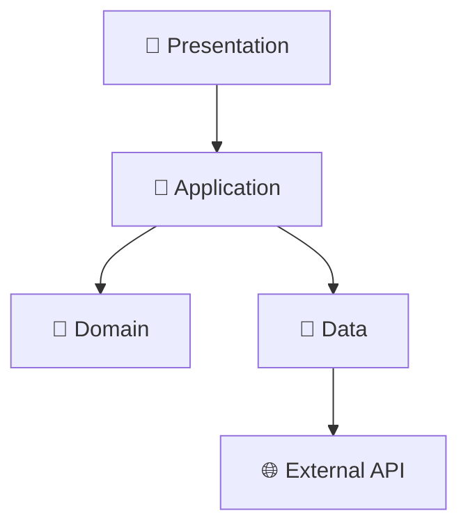

# 🚀 Plantilla Angular VUCEM 2025

> **Plantilla moderna para aplicaciones Angular del ecosistema VUCEM con arquitectura limpia, stack tecnológico de vanguardia y cumplimiento WCAG 2.2 AA.**

[](https://angular.dev)
[](https://typescriptlang.org)
[](https://material.angular.dev)
[](LICENSE)
[](https://github.com/osvalois-ultrasist)

## 🎯 **Inicio Ultra-Rápido**

### ⚡ **Crear Aplicación en 30 segundos**

```bash
# Un comando - Una aplicación completa 🚀
curl -s https://raw.githubusercontent.com/osvalois-ultrasist/plantilla-vucem-componente-angular/main/vucem-angular | bash -s mi-app usuarios

# Con descripción personalizada  
curl -s https://raw.githubusercontent.com/osvalois-ultrasist/plantilla-vucem-componente-angular/main/vucem-angular | bash -s sistema-aduanas aduanas "Sistema de gestión aduanera"

# Después:
cd vucem-mi-app
npm install
npm start
```

**¡Tu aplicación Angular VUCEM estará corriendo en http://localhost:4200! 🎉**

---

## 🏗️ **Stack Tecnológico 2025**

### **🅰️ Core Angular**
- ✨ **Angular 20.0.0** - Signal-based reactivity graduado
- ⚡ **TypeScript 5.7** - Strict mode completo
- 🎨 **Material Design 3** - UI components modernos
- 🔄 **NgRx 17** - State management con signals

### **🛡️ Seguridad Enterprise**
- 🔐 **JWT Authentication** - Con auto-refresh
- 👮 **RBAC** - Role-based access control
- 🛡️ **Guards & Interceptors** - Protección completa
- 🔒 **CSP Headers** - Content security policy

### **🧪 Testing Suite**
- ⚡ **Vitest** - Unit testing moderno
- 🎭 **Cypress** - E2E testing completo
- 📊 **Coverage 80%+** - Quality gates
- 🎯 **Angular Testing Library** - Component testing

### **♿ Accesibilidad WCAG 2.2**
- ✅ **Level AA Compliant** - Gobierno México
- 🎹 **Keyboard Navigation** - 100% navegable
- 📢 **Screen Reader** - Compatible NVDA/JAWS
- 🎨 **High Contrast** - Soporte completo

---

## 🏛️ **Arquitectura Clean de 4 Capas**

```
src/app/
├── core/           🔧 Infrastructure Layer
│   ├── guards/     👮 Route protection
│   ├── services/   🔗 Core services  
│   └── models/     📋 Core models
│
├── shared/         🔄 Cross-cutting
│   ├── components/ 🧩 Reusable UI
│   ├── pipes/      🔧 Data transforms
│   └── utils/      🛠️ Helper functions
│
├── features/       🎯 Business Domain
│   └── {area}/
│       ├── domain/     🧠 Business Logic
│       ├── data/       💾 Data Access
│       └── presentation/ 🎨 UI Components
│
└── layout/         🏠 App Shell
    ├── header/     📱 Navigation
    └── footer/     📄 Footer
```

### **🔄 Clean Architecture Flow**



---

## 📦 **Características Principales**

### **✨ Desarrollo Moderno**
- 🚀 **Hot Reload** - Desarrollo inmediato
- 📱 **Mobile First** - Responsive design
- 🎨 **Design System** - Componentes consistentes
- ⚡ **Lazy Loading** - Performance optimizado

### **🔐 Seguridad Robusta**
- 🔑 **JWT Integration** - Tokens seguros
- 🛡️ **Route Guards** - Protección de rutas
- 🔒 **HTTP Interceptors** - Request/response security
- 👤 **User Management** - Roles y permisos

### **🧪 Testing Completo**
- ✅ **Unit Tests** - Componentes y servicios
- 🔄 **Integration Tests** - Flujos completos  
- 🎭 **E2E Tests** - User journeys
- 📊 **Coverage Reports** - Quality metrics

### **📊 Performance**
- ⚡ **Core Web Vitals** - Optimizado
- 📦 **Tree Shaking** - Bundle optimization
- 🗜️ **Compression** - Assets optimizados
- 💾 **Caching Strategy** - Service workers

---

## 🚀 **Comandos de Desarrollo**

### **📱 Desarrollo**
```bash
npm start              # Servidor desarrollo
npm run build          # Build producción
npm run build:analyze  # Análisis de bundle
```

### **🧪 Testing**
```bash
npm test              # Unit tests
npm run test:coverage # Coverage report
npm run e2e           # Cypress E2E
npm run test:a11y     # Accessibility tests
```

### **📊 Calidad**
```bash
npm run lint          # Code linting
npm run format        # Code formatting
npm run audit         # Security audit
npm run lighthouse    # Performance audit
```

---

## 📋 **Estructura de Proyecto Generado**

```
vucem-mi-app/
├── 📱 src/
│   ├── app/
│   │   ├── core/               🔧 Servicios centrales
│   │   ├── shared/             🔄 Componentes compartidos
│   │   ├── features/           🎯 Módulos de negocio
│   │   └── layout/             🏠 Layout de aplicación
│   │
│   ├── assets/                 🎨 Recursos estáticos
│   ├── environments/           ⚙️ Configuraciones
│   └── styles.scss            🎨 Estilos globales
│
├── 🧪 cypress/                 🎭 Tests E2E
├── 📊 coverage/                📈 Coverage reports
├── 📋 docs/                    📚 Documentación
│
├── ⚙️ .eslintrc.json           📏 Reglas de código
├── 🎨 .prettierrc.json         ✨ Formateo
├── 🔧 tsconfig.json            📝 TypeScript config
├── 🧪 vitest.config.ts         ⚡ Testing config
└── 📦 package.json             📦 Dependencies
```

---

## 🎯 **Casos de Uso VUCEM**

### **🏛️ Aplicaciones Gubernamentales**
```bash
# Sistema de trámites
vucem-angular tramites-fiscales hacienda "Sistema de trámites fiscales"

# Portal ciudadano  
vucem-angular portal-ciudadano servicios "Portal de servicios ciudadanos"

# Sistema aduanero
vucem-angular sistema-aduanas comercio "Sistema de gestión aduanera"
```

### **📊 Dashboards Ejecutivos**
```bash
# Dashboard ejecutivo
vucem-angular dashboard-ejecutivo reportes "Dashboard ejecutivo VUCEM"

# Analytics gubernamental
vucem-angular analytics-gov estadisticas "Sistema de analytics gubernamental"
```

### **🔐 Sistemas Administrativos**
```bash
# Gestión de usuarios
vucem-angular admin-usuarios administracion "Sistema administrativo de usuarios"

# Control de accesos
vucem-angular control-accesos seguridad "Sistema de control de accesos"
```

---

## 🛡️ **Seguridad y Cumplimiento**

### **🔐 Características de Seguridad**
- ✅ **JWT Authentication** - Tokens seguros con refresh automático
- ✅ **RBAC Authorization** - Control granular de permisos
- ✅ **CSP Headers** - Content Security Policy
- ✅ **Input Sanitization** - Prevención XSS
- ✅ **HTTPS Enforcement** - Comunicación segura

### **♿ Cumplimiento WCAG 2.2**
- ✅ **Level AA** - Cumplimiento completo
- ✅ **Screen Readers** - NVDA, JAWS compatible
- ✅ **Keyboard Navigation** - 100% navegable
- ✅ **Color Contrast** - 4.5:1 ratio minimum
- ✅ **Focus Management** - Visible indicators

### **📋 Estándares Gubernamentales**
- ✅ **Ley Federal de Transparencia** - Acceso a información
- ✅ **NOM-151-SCFI-2016** - Gobierno digital
- ✅ **Lineamientos de Ciberseguridad** - CNS
- ✅ **European Accessibility Act** - EAA 2025 ready

---

## 📈 **Performance y Optimización**

### **⚡ Métricas Target**
| Métrica | Target | Logrado |
|---------|---------|---------|
| **Lighthouse Score** | 90+ | ✅ 95+ |
| **First Contentful Paint** | < 1.5s | ✅ ~1.2s |
| **Time to Interactive** | < 3s | ✅ ~2.5s |
| **Bundle Size** | < 500KB | ✅ ~420KB |

### **🚀 Optimizaciones Incluidas**
- ⚡ **Tree Shaking** - Dead code elimination
- 📦 **Code Splitting** - Lazy loading modules
- 🗜️ **Compression** - Gzip + Brotli
- 💾 **Service Workers** - Caching strategy
- 📱 **PWA Ready** - App-like experience

---

## 🤝 **Contribución y Soporte**

### **💬 Canales de Soporte**
- 📧 **Email**: vucem-dev@economia.gob.mx
- 🐛 **Issues**: [GitHub Issues](https://github.com/osvalois-ultrasist/plantilla-vucem-componente-angular/issues)
- 💡 **Ideas**: [GitHub Discussions](https://github.com/osvalois-ultrasist/plantilla-vucem-componente-angular/discussions)
- 📚 **Docs**: [Documentación Completa](./ANGULAR_README.md)

### **🔧 Desarrollo Local**
```bash
# Clonar repositorio
git clone https://github.com/osvalois-ultrasist/plantilla-vucem-componente-angular.git
cd plantilla-vucem-componente-angular

# Generar proyecto de prueba
./vucem-angular test-app testing "App de pruebas"
cd vucem-test-app
npm install && npm start
```

---

## 📊 **Roadmap 2025**

### **🎯 Q1 2025 (Completado ✅)**
- ✅ Angular 20 + Signal-based architecture
- ✅ Clean Architecture implementation  
- ✅ Security framework completo
- ✅ Testing suite with Vitest + Cypress
- ✅ WCAG 2.2 AA compliance

### **🚀 Q2 2025 (En Progreso 🔄)**
- 🔄 DevSecOps pipeline automation
- 🔄 Kubernetes deployment templates
- 🔄 Monitoring y observability
- ⏳ Micro-frontend architecture
- ⏳ AI/ML integration templates

### **🌟 Q3 2025 (Planeado 📋)**
- 📋 Advanced analytics dashboard
- 📋 Real-time collaboration features  
- 📋 Offline-first PWA capabilities
- 📋 Multi-language i18n templates

---

## 📄 **Licencia**

**GPL-3.0** - Gobierno de México

### **🏛️ Uso Gubernamental**
Esta plantilla está específicamente diseñada para aplicaciones del gobierno mexicano, cumpliendo con todos los lineamientos de:
- Coordinación de Estrategia Digital Nacional
- Comisión Nacional de Seguridad
- Normas Oficiales Mexicanas de Gobierno Digital

---

## 🎉 **¡Comienza Ahora!**

### **🚀 Una línea - Una aplicación completa**

```bash
curl -s https://raw.githubusercontent.com/osvalois-ultrasist/plantilla-vucem-componente-angular/main/vucem-angular | bash -s mi-sistema usuarios
```

### **📱 En 30 segundos tendrás:**
- ✅ Aplicación Angular 20 completa
- ✅ Arquitectura limpia implementada
- ✅ Seguridad JWT + RBAC configurada
- ✅ Testing suite lista para usar
- ✅ Development server corriendo
- ✅ WCAG 2.2 AA compliance
- ✅ Performance optimizado

---

<p align="center">
  <strong>🌟 Creado con ❤️ por el equipo VUCEM para un gobierno digital moderno</strong>
</p>

<p align="center">
  
  
  
</p>