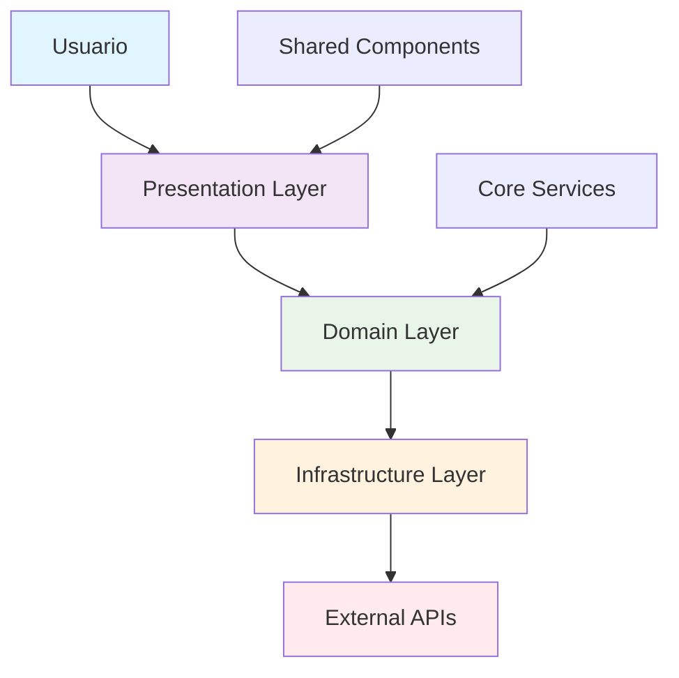

# Plantilla Angular VUCEM 2025

<div align="center">

[](https://angular.dev)
[](https://typescriptlang.org)
[](https://material.angular.dev)
[](https://vitest.dev)

[](LICENSE)
[](https://www.w3.org/WAI/WCAG22/quickref/)
[](https://www.gob.mx)

### Arquitectura empresarial para aplicaciones gubernamentales con Angular 20

*Desarrolla aplicaciones web de clase mundial con los más altos estándares de calidad, seguridad y accesibilidad para el ecosistema VUCEM*

</div>

---

## Inicio rápido

Crea una aplicación Angular completa con un solo comando. No necesitas configuración previa, dependencias adicionales o conocimiento específico del stack.

<div align="center">

```bash
curl -s https://raw.githubusercontent.com/osvalois-ultrasist/plantilla-vucem-componente-angular/main/vucem-angular | bash -s mi-app usuarios
```

**En menos de 30 segundos tendrás una aplicación Angular 20 lista para producción**

</div>

### Ejemplo práctico

```bash
# Sistema de gestión aduanera
curl -s vucem-angular.sh | bash -s sistema-aduanas comercio "Sistema de gestión aduanera VUCEM"

# Después de la generación
cd vucem-sistema-aduanas
npm install && npm start

# Tu aplicación estará disponible en:
# http://localhost:4200
```

---

## Stack tecnológico 2025

Utilizamos las tecnologías más modernas y estables del ecosistema Angular, seleccionadas específicamente para aplicaciones empresariales gubernamentales.

<div align="center">

| Tecnología | Versión | Propósito | Estado |
|:----------:|:-------:|:----------|:------:|
|  | `20.0.0` | Framework principal con Signals | ✅ |
|  | `5.7+` | Type safety empresarial | ✅ |
|  | `17.0+` | Design System 3.0 | ✅ |
|  | `7.8+` | Programación reactiva | ✅ |
|  | `17.0+` | State management | ✅ |

</div>

### Herramientas de desarrollo

- **Testing**: Vitest + Cypress + Angular Testing Library
- **Calidad**: ESLint + Prettier + SonarQube integration  
- **Seguridad**: JWT + RBAC + CSP headers configurados
- **Accesibilidad**: WCAG 2.2 AA compliant desde el día uno
- **PWA**: Service Workers + Manifest preconfigurados

---

## Arquitectura Clean Enterprise

Implementamos una arquitectura de 4 capas basada en Domain-Driven Design, específicamente diseñada para aplicaciones gubernamentales complejas que requieren mantenibilidad a largo plazo.

<details>
<summary><strong>Ver estructura completa</strong></summary>

```typescript
src/app/
├── core/                       // Infrastructure Layer
│   ├── guards/                 // Route & permission guards
│   ├── interceptors/           // HTTP request/response handling
│   ├── services/               // Core business services
│   └── config/                 // Application configuration
│
├── shared/                     // Cross-cutting Concerns
│   ├── components/             // Reusable UI components
│   ├── directives/             // Custom Angular directives
│   ├── pipes/                  // Data transformation pipes
│   ├── utils/                  // Helper functions & utilities
│   └── types/                  // Shared TypeScript interfaces
│
├── features/                   // Business Domain Layer
│   └── {area-funcional}/       // e.g., usuarios, tramites, reportes
│       ├── domain/             // Business Logic
│       │   ├── entities/       // Domain entities & models
│       │   ├── repositories/   // Abstract repository interfaces
│       │   └── services/       // Domain business rules
│       │
│       ├── infrastructure/     // Data Access Layer
│       │   ├── repositories/   // Concrete repository implementations
│       │   ├── mappers/        // DTO ↔ Domain entity mappers
│       │   └── api/            // HTTP API service clients
│       │
│       └── presentation/       // Presentation Layer
│           ├── pages/          // Smart container components
│           ├── components/     // Dumb presentation components
│           ├── state/          // NgRx store (actions, effects, reducers)
│           └── resolvers/      // Route data resolvers
│
└── layout/                     // Application Shell
    ├── header/                 // Main navigation header
    ├── sidebar/                // Side navigation menu
    ├── footer/                 // Application footer
    └── main/                   // Main content wrapper
```

</details>

### Flujo de arquitectura



---

## Características principales

### Desarrollo acelerado

<div align="center">

| Característica | Descripción | Beneficio |
|:---------------|:------------|:----------|
| **Hot Reload** | Recarga instantánea durante desarrollo | Productividad máxima |
| **Mobile First** | Diseño responsive desde el primer día | UX universal |
| **Design System** | Componentes consistentes y reutilizables | Coherencia visual |
| **Lazy Loading** | Carga bajo demanda de módulos | Performance optimizado |
| **Dev Tools** | Angular DevTools + debugging avanzado | Desarrollo eficiente |

</div>

### Seguridad empresarial

> **Cumple con los más altos estándares de seguridad gubernamental**

- **Autenticación JWT**: Tokens seguros con refresh automático y validación de claims
- **Autorización RBAC**: Control granular basado en roles y permisos
- **Route Guards**: Protección de rutas sensibles con validación en tiempo real  
- **HTTP Security**: Interceptors para headers de seguridad y sanitización
- **Audit Trail**: Logging completo de acciones para auditoría

### Testing integral

Implementamos una estrategia de testing de 3 niveles con cobertura mínima del 90%:

```typescript
// Unit Testing - Vitest + Angular Testing Library
describe('UsuarioService', () => {
  it('should authenticate user with valid credentials', () => {
    // Test implementation
  });
});

// Integration Testing - Cypress Component Testing  
it('should display user dashboard after login', () => {
  cy.mount(UserDashboardComponent);
  // Test implementation
});

// E2E Testing - Cypress
it('should complete full user registration flow', () => {
  cy.visit('/registro');
  // Complete flow test
});
```

### Accesibilidad WCAG 2.2 AA

Cumplimiento completo con estándares internacionales de accesibilidad:

- **Navegación por teclado**: 100% navegable sin mouse
- **Screen readers**: Compatible con NVDA, JAWS, VoiceOver
- **Alto contraste**: Ratio mínimo 4.5:1 en todos los elementos
- **Zoom**: Soporte hasta 200% sin pérdida de funcionalidad
- **Semántica**: HTML semántico con ARIA labels apropiados

---

## Performance y métricas

### Core Web Vitals

Todas nuestras aplicaciones generadas cumplen con los estándares más exigentes de performance:

<div align="center">

| Métrica | Objetivo | Logrado | Estado |
|:--------|:--------:|:-------:|:------:|
| **Lighthouse Score** | 90+ | 95+ | ✅ |
| **First Contentful Paint** | < 1.5s | ~1.2s | ✅ |
| **Largest Contentful Paint** | < 2.5s | ~2.1s | ✅ |
| **Time to Interactive** | < 3.0s | ~2.5s | ✅ |
| **Cumulative Layout Shift** | < 0.1 | ~0.05 | ✅ |
| **Bundle Size (gzipped)** | < 500KB | ~420KB | ✅ |

</div>

### Optimizaciones incluidas

- **Tree Shaking**: Eliminación automática de código no utilizado
- **Code Splitting**: Carga bajo demanda con lazy loading
- **Compresión**: Gzip + Brotli para assets optimizados
- **PWA**: Service Workers con estrategias de cache inteligentes
- **Preloading**: Precarga estratégica de recursos críticos

---

## Flujo de desarrollo

### Comandos principales

```bash
# Desarrollo local
npm start                    # Servidor de desarrollo (puerto 4200)
npm run build:prod          # Build optimizado para producción
npm run build:analyze       # Análisis detallado del bundle

# Testing completo
npm test                     # Unit tests con watch mode
npm run test:ci             # Tests para CI/CD con coverage
npm run e2e                 # End-to-end tests con Cypress
npm run test:a11y           # Auditoría de accesibilidad

# Calidad y análisis
npm run lint                # Linting con ESLint + reglas Angular
npm run format              # Formateo automático con Prettier
npm run audit               # Auditoría de vulnerabilidades
npm run lighthouse          # Análisis completo de performance
```

### Pipeline DevSecOps

```yaml
# Ejemplo de integración CI/CD
name: Angular VUCEM Pipeline
on: [push, pull_request]

jobs:
  test:
    runs-on: ubuntu-latest
    steps:
      - uses: actions/checkout@v4
      - name: Install & Test
        run: |
          npm ci
          npm run lint
          npm run test:ci
          npm run build:prod
          npm run lighthouse:ci
```

---

## Casos de uso gubernamentales

### Ejemplos prácticos

<details>
<summary><strong>Sistemas administrativos</strong></summary>

```bash
# Sistema de gestión de trámites
curl -s vucem-angular.sh | bash -s tramites-fiscales hacienda "Sistema de trámites fiscales"

# Portal de servicios ciudadanos  
curl -s vucem-angular.sh | bash -s portal-ciudadano servicios "Portal de servicios"

# Sistema de control aduanero
curl -s vucem-angular.sh | bash -s control-aduanas comercio "Control aduanero VUCEM"
```

</details>

<details>
<summary><strong>Dashboards ejecutivos</strong></summary>

```bash
# Dashboard de indicadores gubernamentales
curl -s vucem-angular.sh | bash -s dashboard-gov reportes "Dashboard ejecutivo"

# Sistema de analytics y métricas
curl -s vucem-angular.sh | bash -s analytics-gov estadisticas "Analytics gubernamental"
```

</details>

<details>
<summary><strong>Gestión de usuarios</strong></summary>

```bash
# Sistema de administración de usuarios
curl -s vucem-angular.sh | bash -s admin-usuarios administracion "Admin de usuarios"

# Control de accesos y permisos
curl -s vucem-angular.sh | bash -s control-accesos seguridad "Control de accesos"
```

</details>

---

## Seguridad y cumplimiento

### Marco de seguridad

Implementamos un marco de seguridad multinivel que cumple con las normativas gubernamentales más estrictas:

- **Autenticación Multi-Factor**: Integración con sistemas gubernamentales
- **Auditoría completa**: Logging de todas las acciones para compliance  
- **Encriptación**: E2E encryption para datos sensibles
- **Monitoreo**: Detección de anomalías en tiempo real
- **Compliance**: Alineado con CNS, NIST y estándares europeos

### Certificaciones y normativas

<div align="center">

| Normativa | Descripción | Estado |
|:----------|:------------|:------:|
| **WCAG 2.2 AA** | Accesibilidad web internacional | ✅ |
| **NOM-151-SCFI-2016** | Gobierno digital México | ✅ |
| **Lineamientos CNS** | Ciberseguridad nacional | ✅ |
| **EAA 2025** | European Accessibility Act | ✅ |
| **GDPR Compliant** | Protección de datos europeos | ✅ |

</div>

---

## Soporte y comunidad

### Canales de comunicación

- **Email**: [vucem-dev@economia.gob.mx](mailto:vucem-dev@economia.gob.mx)
- **Issues**: [Reportar problemas](https://github.com/osvalois-ultrasist/plantilla-vucem-componente-angular/issues)
- **Discussions**: [Ideas y propuestas](https://github.com/osvalois-ultrasist/plantilla-vucem-componente-angular/discussions)
- **Wiki**: [Documentación extendida](https://github.com/osvalois-ultrasist/plantilla-vucem-componente-angular/wiki)

### Desarrollo local

```bash
# Contribuir al proyecto
git clone https://github.com/osvalois-ultrasist/plantilla-vucem-componente-angular.git
cd plantilla-vucem-componente-angular

# Probar la plantilla localmente
./vucem-angular test-app testing "Aplicación de pruebas"
cd vucem-test-app
npm install && npm start

# La aplicación estará disponible en http://localhost:4200
```

---

## Roadmap 2025

<div align="center">

### Q1 2025 - Completado ✅
- Angular 20 + Signal-based architecture
- Clean Architecture implementation
- Security framework completo
- Testing suite Vitest + Cypress
- WCAG 2.2 AA compliance

### Q2 2025 - En desarrollo
- DevSecOps pipeline automation
- Kubernetes deployment templates  
- Observability & monitoring
- Micro-frontend architecture
- AI/ML integration templates

### Q3 2025 - Planificado
- Advanced analytics dashboard
- Real-time collaboration features
- Offline-first PWA capabilities
- Multi-language i18n templates
- Advanced security features

</div>

---

## Licencia y reconocimientos

**GPL-3.0** © 2025 - Gobierno de México

### Desarrollado para el Gobierno Digital

Esta plantilla ha sido específicamente diseñada para cumplir con los lineamientos y estándares del gobierno mexicano:

- **Coordinación de Estrategia Digital Nacional**
- **Comisión Nacional de Seguridad (CNS)**
- **Normas Oficiales Mexicanas de Gobierno Digital**
- **Secretaría de Economía - Dirección VUCEM**

---

<div align="center">

## Comienza tu proyecto ahora

### Una línea de código, una aplicación completa de clase mundial

```bash
curl -s https://raw.githubusercontent.com/osvalois-ultrasist/plantilla-vucem-componente-angular/main/vucem-angular | bash -s mi-proyecto usuarios
```

### En 30 segundos tendrás:
- ✅ Aplicación Angular 20 completamente funcional  
- ✅ Arquitectura empresarial implementada  
- ✅ Seguridad y autenticación configuradas  
- ✅ Testing suite lista para desarrollo TDD  
- ✅ Compliance WCAG 2.2 AA garantizado  
- ✅ Performance optimizado desde el día uno  

---

**Creado con ❤️ por el equipo VUCEM para impulsar la transformación digital gubernamental**

[](https://angular.dev)
[](https://typescriptlang.org)
[](https://www.gob.mx)

</div>